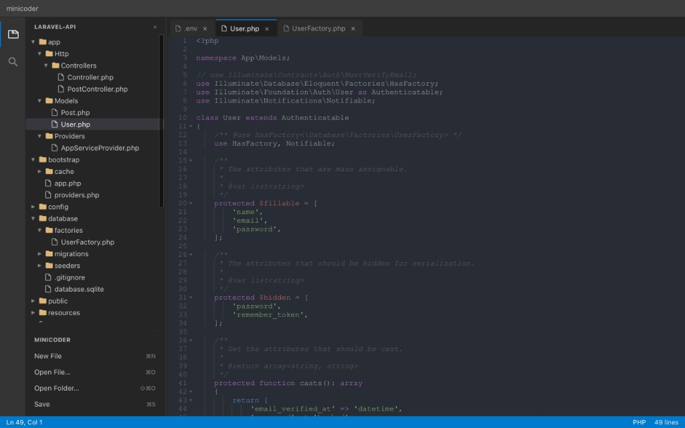
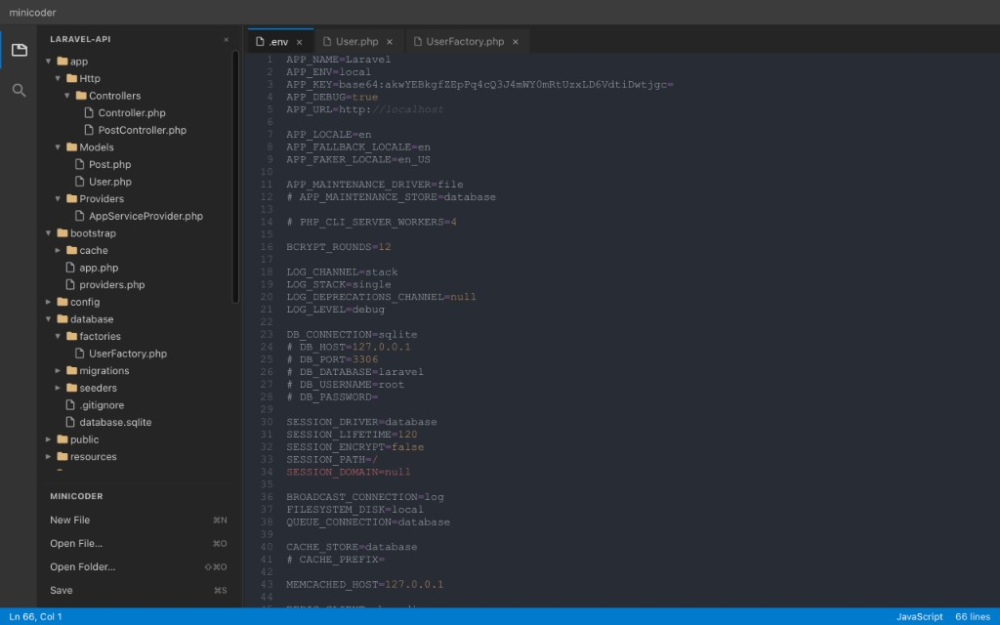
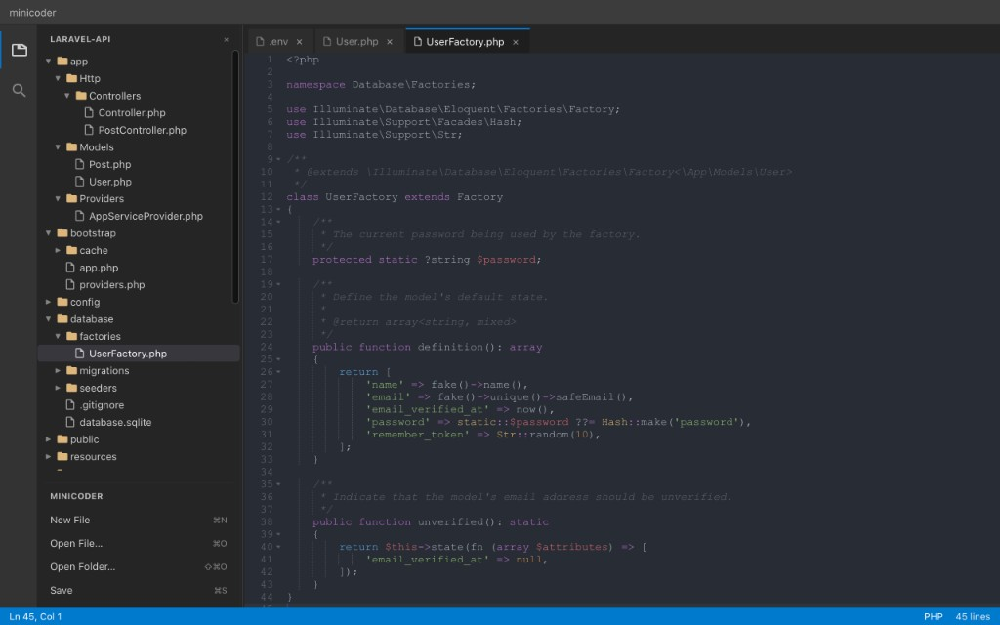

# minicoder

A small **desktop text and code editor** inspired by Visual Studio Code, built with **[Tauri 2](https://v2.tauri.app/)**, **React 19**, **Vite**, and **[Ace](https://ace.c9.io/)** via `react-ace`. It runs as a native app on macOS, Windows, and Linux.

Use it to work on **any local project**—open a folder, browse files, edit with syntax highlighting, and search the tree—whether you are building a web app, API, script, config repo, or something else entirely.

## What it does

- **Workbench UI** — Activity bar, sidebar (Explorer / workspace search), tabbed editor, and status bar with line/column, language label, and line count.
- **Files** — Open files or an entire folder; browse the tree; open multiple **tabs**; save; keyboard shortcuts for new file, open, open folder, save, and close tab.
- **Editing** — Syntax highlighting for many common languages, with optional language detection when there is no clear filename to go on.
- **Workspace search** — After opening a folder, filter files by path or name from the sidebar.

For step-by-step setup notes (dependencies, Tauri plugins, Tailwind), see **[instruction.md](./instruction.md)**.

## Screenshots

Project tree, tabbed editor, and quick actions (New File, Open File, Open Folder, Save).

<p align="center">
  
</p>

Several files open at once; status bar shows cursor position and language mode.

<p align="center">
  
</p>

Syntax highlighting and line count in the status bar.

<p align="center">
  
</p>

## Development

```bash
pnpm install
pnpm tauri dev
```

Build a release binary:

```bash
pnpm tauri build
```

## License

See the repository license file if present; otherwise treat as private or add a license as needed.
